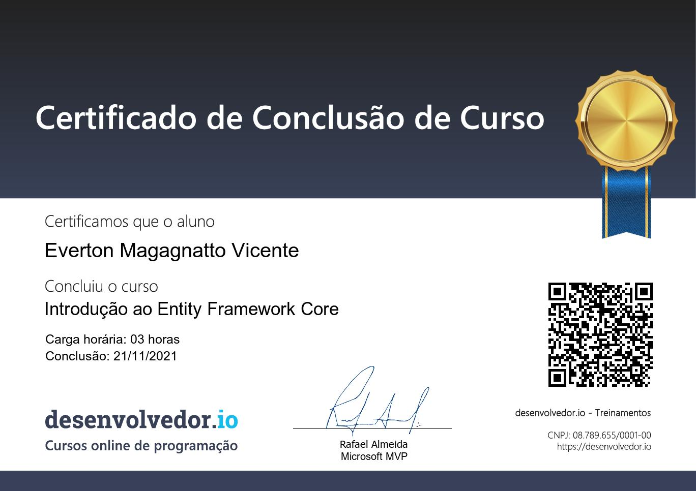

# Introdução ao Entity Framework Core

Course / Curso: [Introducao ao entityFramework Core](https://desenvolvedor.io/curso-online-introducao-entity-framework-core)

## Presentation / Apresantação
A Microsoft revolucionou o desenvolvimento de aplicações com o .NET Core e reescreveu do zero o Entity Framework na versão Core, que está muito mais poderoso e performático.

Neste curso você vai aprender os fundamentos do Entity Framework Core, como instalar, configurar e utilizar de forma completa, é o primeiro passo para continuar estudando os materiais mais avançados sobre acesso a dados.

## Instructor / Instrutor

### [Rafael Almeida](https://desenvolvedor.io/instrutor/rafael-almeida) • Microsoft MVP

> Rafael Almeida é Microsoft MVP, arquiteto e desenvolvedor de software, palestrante, instrutor e contribuidor de projetos open source, dentre eles o Entity Framework Core.
>
> Casado, pai da Eduarda e Heloysa, autodidata, apaixonado por tecnologia, em especial arquitetura de software e acesso a dados.
>
> Tem mais 14 anos de experiência com desenvolvimento de software. Já trabalhou em muitos projetos de desenvolvimento de software, com foco especial em .NET, design/desenvolvimento de banco de dados.
>
> Apaixonado por projetos de código aberto, devops, arquitetura de microsserviços, transformação digital e acesso a dados de alto desempenho, é um curioso da tecnologia blockchain.
>
> Adora compartilhar conhecimento e aprender novas tecnologias. Sempre focando em resolver problemas e ajudar as pessoas.
>
> Sua stack de paixões são:
>
> .NET, Apache Kafka, Entity Framework Core, gRPC, PostgreSQL, ScyllaDB (seu caçula) e acesso a dados de alta performance.
Links:

- [Website](https://www.ralms.net/)
- [GitHub](https://github.com/ralmsdeveloper/)
- [Linkedin](https://www.linkedin.com/in/ralmsdeveloper/)

## Certificado

## Course Progress / Progresso do curso

### Introdução

- [x] Introdução (1:00)
- [x] O que é ORM? (2:00)
- [x] Orientação a Objetos vs Modelo Relacional (6:00)
- [x] O que é o Entity Framework Core? (1:00)
- [x] Como Funciona o Entity Framework Core? (4:00)
- [x] História do Entity Framework (4:00)
- [x] História do Entity Framework Core (2:00)
- [x] Por que o Entity Framework Core foi reescrito do zero? (1:00)
- [x] Quais são os providers disponíveis? (2:00)
- [x] EF 6 vs EF Core (4:00)
- [x] Teste os seus Conhecimentos (3:00)

### Ambiente de desenvolvimento - IDE's

- [x] IDE's disponiveis (4:00)
- [x] Instalação do SDK do .NET Core (3:00)
- [x] Instalação das extensões no VS Code (3:00)
- [x] Instalação do SQL Server LocalDB (2:00)
- [x] Teste os seus conhecimentos (5:00)

### Minha primeira aplicação

- [x] Criando uma aplicação console no Visual Studio (3:00)
- [x] Instalando o pacote do SqlServer Visual Studio Code (1:00)
- [x] Instalando o Pacote SqlServer Visual Studio (2:00)

### Conceitos Principais

- [x] Por onde começar (1:00)
- [x] O que é Code First (2:00)
- [x] O que é Database First (2:00)
- [x] O que é DbContext (4:00)
- [x] Teste os seus conhecimentos (5:00)

### Cenários de utilização

- [x] Sistema de Pedidos (1:00)
- [x] Criação de classes (6:00)
- [x] Criação da classe de contexto (6:00)
- [x] Mapeamento através do Fluent API (13:00)
- [x] Arquivos de configurações (10:00)
- [x] Utilizando DataAnnotations (5:00)
- [x] Teste os seus conhecimentos (5:00)

### Migrações

- [x] Introdução (2:00)
- [x] O que é necessário para criar uma migração? (7:00)
- [x] Criando a primeira migração (4:00)
- [x] Analisando a migração (6:00)
- [x] Gerando Script SQL (5:00)
- [x] Aplicando migração (5:00)
- [x] Gerando Scripts SQL Idempotentes (5:00)
- [x] Rollback de migrações (5:00)
- [x] Migrações pendentes (3:00)
- [x] Teste os seus conhecimentos (5:00)

### Operações

- [x] Operaç~]oes que iremos executar (1:00)
- [x] Inserindo Registros (8:00)
- [x] Inserindo registros em massa (10:00)
- [x] Consultando dados (11:00)
- [x] Carregamento adiantado (9:00)
- [x] Atualizando Registros (10:00)
- [x] Removendo registros (8:00)
- [x] Teste seus conhecimentos (5:00)

### Aulas Bônus

- [x] Detectando propriedades não configuradas (6:00)
- [x] Resiliência da conexão (3:00)
- [x] Alterando o nome da tabela de histórico de migrações (2:00)

### Encerramento

- [x] Agradecimentos (1:00)
